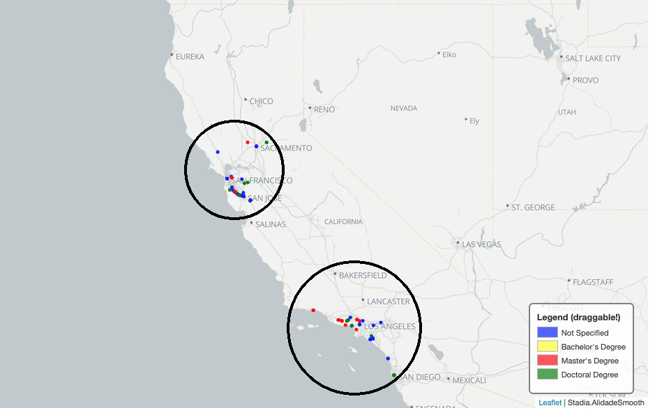
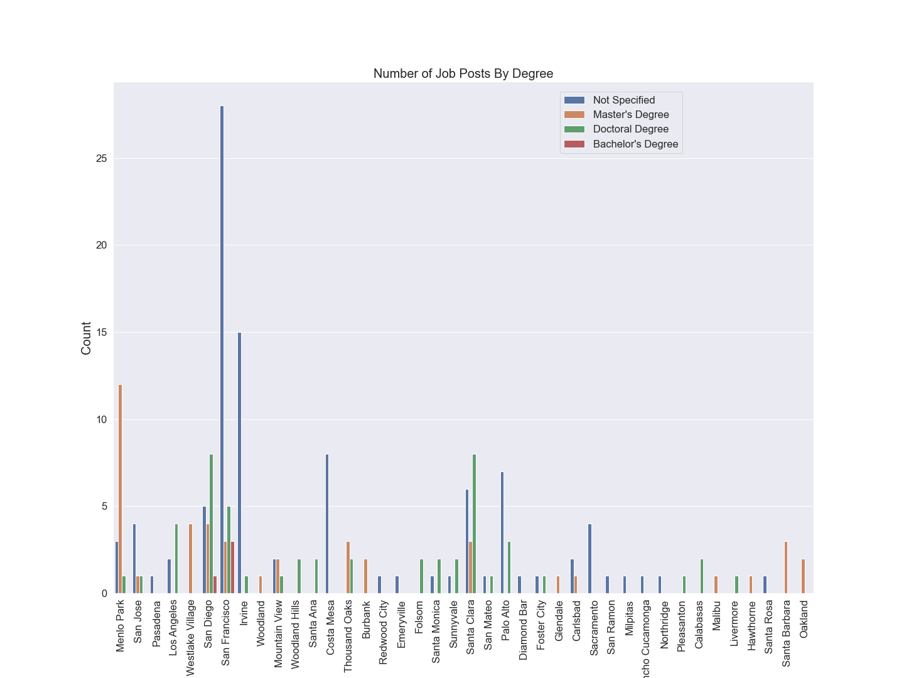

# California Data Science Job Market Analysis

<!-- Add buttons here -->

**Project Status: Completed**
 
<a href="https://nbviewer.jupyter.org/github/navido89/DS-Job-Market-Analysis/blob/master/Indeed-DS-Jobs-Final.ipynb" target="_blank">Jupyter Notebook Viewer</a>
 
<a href="" target="_blank">Read Article</a>

## Table of contents
- [Project Objective](#project-objective)
- [Methods Used](#methods-used)
- [Technologies](#technologies)
- [Project Description](#project-description)
- [Project Results](#project-results)
- [Installation](#installation)

## Project Objective
[(Back to top)](#table-of-contents)
 
The purpose of this project is to examine the current data science job market in California. Which city has the most job posts in CA and offers more opportunities? As a current Data Science Master's student, I wanted to find out which jobs a master's degree holder would be eligible to apply for and what skills are most in-demand.
 

## Methods Used
[(Back to top)](#table-of-contents)
+ Data Collection
+ Data Cleaning
+ Exploratory Data Analysis
+ Data Visualization

## Technologies:
[(Back to top)](#table-of-contents)
+ BeautifulSoup
+ Selenium 
+ ChromeDriverManager
+ NumPy 
+ Time
+ Random 
+ Pandas 
+ Uszipcode 
+ Seaborn
+ Folium
+ Nominatim
+ Matplotlib
+ Template
+ MacroElement
+ Copy
+ PrettyTable

## Project Description:
[(Back to top)](#table-of-contents)

+ Web scraped the indeed website to collect data on the most recent data science job postings in California. 
+ Cleaned the data by using pandas. 
+ Regarding feature engineering I added location coordinates, location population data, created indicator columns (with value True/False) for skills and tools.
+ To read more about the data cleaning and feature engineering process <a href="" target="_blank">click here.</a>
+ Conducted an exploratory data analysis (EDA) to investigate the current data science job market in California. 

## Project Results:
[(Back to top)](#table-of-contents)
 
Between December 13th and December 27th, most of the data science job posts came from the following locations:
+ San Francisco: 39 Jobs
+ San Diego: 18 Jobs
+ Santa Clara: 17 Jobs

However, based on each region's population and the number of job postings the results are different if we consider the number of job posts based on the 100,000 population rate. The count of job posts per location was divided by the matching city's population and multiplied by 100,000. As a result, the top 3 cities were:
+ Westlake Village: 48 Job
+ Menlo Park: 46 Jobs
+ Palo Alto: 15 Jobs

As expected, when we look at the map below, most of the job opportunities come from Northern California (Bay Area) and Southern California (LA & San Diego). There are not a lot of opportunities in Central California.

Below we can see that 50.25% of all the job postings haven't specified a minimum degree requirement. 2.03% require a bachelor's degree, 22.34% a master's degree and 25.38% a doctoral degree.

 

San Francisco has the highest amount of job postings where a degree hasn't been specified in terms of location and minimum degree requirement. Menlo Park has the highest amount of job postings where the minimum requirement is a master's degree. Santa Clara and San Diego have the most job postings where a doctoral degree is a minimum requirement. San Francisco is also the city that has posted the most job postings where a bachelor's degree is a minimum requirement. See below:

Out of all 197 data science jobs from the past 2 weeks, we can see the break down below, which shows the number of job postings per degree:
+ Bachelor's Degree: 4
+ Doctoral Degree: 50
+ Master's Degree: 44
+ Not Specified: 99

An applicant holding a bachelor's degree can apply to 52.28% of all the job postings ((4+99)/197). Holding a master's degree makes you eligible to apply for 74.61% of the jobs and a Ph.D. holder meets the minimum education requirement for all job postings. Below we can see the plot of a master's degree holder and its eligibility status.

Plus, I have also added a folium plot that shows which jobs a Master's degree holder can apply for. I think the folium plot gives a nice overview.

Finally, when we take a look at the top 5 skills from all the job postings, we get the following result:

+ Python: 148 counts
+ Machine Learning: 148 counts
+ Research: 109 counts
+ Statistics: 89counts
+ SQL: 71 counts
  
Please <a href="" target="_blank"> click here</a> for final conclusion.

## Installation:
[(Back to top)](#table-of-contents)
+ Clone this repo <a href="https://docs.github.com/en/free-pro-team@latest/github/creating-cloning-and-archiving-repositories/cloning-a-repository" target="_blank">(for help see this tutorial).</a>
+ Raw data, data processing/transformation script is being kept in this repo. <a href="https://github.com/navido89/DS-Job-Market-Analysis/blob/master/Indeed-DS-Jobs-Final.ipynb" target="_blank">Click here for notebook.</a>
+ **Note**: If GitHub doesn't load the notebook please refer to <a href="https://nbviewer.jupyter.org/github/navido89/DS-Job-Market-Analysis/blob/master/Indeed-DS-Jobs-Final.ipynb" target="_blank">Jupyter Notebook Viewer.</a>
